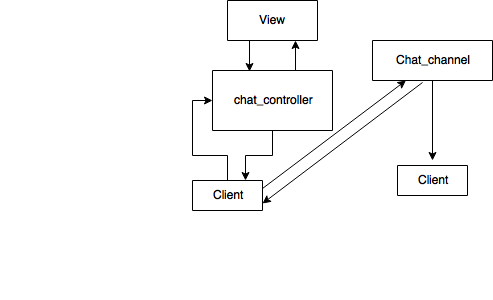
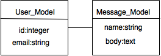

# README

##課題　『LINE』を作る

###はじめに
今回、「LINE」を作るといった課題において、オープンソースのWebアプリケーションフレームワーク「Ruby on Rails」を使うことにした。今回の課題は１対１でメッセージを送りあることのできるアプリケーションを作成するということで、Action CableとういうWebSocketとRailsのその他の部分をシームレスに統合するためのものを使用することにする。

###実行環境

* ruby 2.4.1

* Rails 5.1.4

* Database:MySQL(開発環境),postresql(本番環境)

* jQuery

###アプリケーションの操作
1. ログイン画面においてログイン
2. サインアップした後、『LINE』の表記をクリック
3. チャットルームに行くことができ、メッセージを送ることができる
4. メッセージは「×」で削除することができる

###アプリケーションの構成

**概要**

出版側はまず、ルートを通って、コントロール、そしてビューにアクセスし、メッセージを送信、そのメッセージはチャネルを通して、出版側と購読者に送られる。

[構図]

[モデル図]

* User:ログインしたユーザの情報
* Message:メッセージを送る側のメールアドレスとメッセージ

